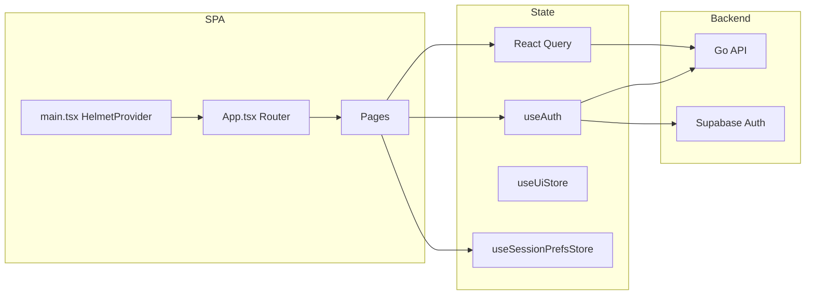

# My Protector — Complete implementation reference

This is the **exhaustive** record of the SEO differentiation, routing, CTAs, authentication, state management, styling, and documentation work for the **TrustLeader** frontend package **`@workspace/trustleader`** (My Protector branding). It is intended for handover, audit, and legal/product review.

A shorter summary remains in [`MY_PROTECTOR_SEO_AND_PRODUCT_LAUNCH.md`](MY_PROTECTOR_SEO_AND_PRODUCT_LAUNCH.md). **This document goes deeper**: every area of the stack touched, behaviour, file paths, keys, and how to verify.

### Progress (% done vs remaining)

**Full program (out of 100): ~65%** — same scale as [`MY_PROTECTOR_SEO_AND_PRODUCT_LAUNCH.md`](MY_PROTECTOR_SEO_AND_PRODUCT_LAUNCH.md): **~95%** milestone completion minus **10%** (UI) minus **15%** (data) minus **5%** (OAuth + Resend + domain/env).

| Scope | Estimate | Notes |
|-------|------------|--------|
| **Full product program** | **~65%** | **95 − 10 − 15 − 5** on one 100-point scale; see launch doc. |
| **This milestone — engineering (planned code)** | **~95% complete** | All deliverables implemented: i18n, routes, redirects, SEO head, empty-state CTA, header CTAs, reseller registration client, Zustand prefs, colour pass, docs. |
| **Gap within engineering** | **~5%** | Optional: wire `useUiStore` to a future mobile menu; add `robots.txt` / `sitemap.xml` if desired. |
| **Launch readiness (broader, milestone only)** | **~65–75%** | Adds non-code work: manual QA, legal/copy sign-off, prod env (`VITE_SITE_URL`), monitoring, any CMS workflow. |
| **Reserved — UI** | **10%** of full program | Planned UI changes. |
| **Reserved — data** | **15%** of full program | Scrape/source, load, verify data in product. |
| **Reserved — OAuth + email + domain** | **5%** of full program | Google OAuth (Supabase), Resend (`RESEND_API_KEY`, `NOTIFY_FROM_EMAIL`), `PUBLIC_APP_URL` / `VITE_SITE_URL`, live domain. Owner email on new review is **implemented in Go** but **inactive** until env is set. |
| **Remaining / not in this milestone** | — | Public `POST` business creation API; full competitor audit; optional `/auth/create-account` URL rename. |

**Remaining work in short:** manual tests ([§20](#20-testing-matrix-manual)); optional static SEO files; production config; human review; **UI pass**; **data pipeline + QA**; **OAuth + Resend + domain**; any future backend listing-creation feature.

---

## Table of contents

1. [Business context and goals](#1-business-context-and-goals)  
2. [High-level architecture](#2-high-level-architecture)  
3. [Dependencies and lockfile](#3-dependencies-and-lockfile)  
4. [URL design: canonical routes and legacy redirects](#4-url-design-canonical-routes-and-legacy-redirects)  
5. [File-by-file change inventory](#5-file-by-file-change-inventory)  
6. [Routing (`App.tsx`) in detail](#6-routing-apptsx-in-detail)  
7. [Central route constants (`routes.ts`)](#7-central-route-constants-routests)  
8. [Legacy redirect components](#8-legacy-redirect-components)  
9. [Internationalisation (`i18n.ts`)](#9-internationalisation-i18nts)  
10. [SEO: `index.html`, `SeoHead`, environment](#10-seo-indexhtml-seohead-environment)  
11. [Page-by-page behaviour](#11-page-by-page-behaviour)  
12. [Layout and header (navigation, CTAs)](#12-layout-and-header-navigation-ctas)  
13. [Authentication and registration](#13-authentication-and-registration)  
14. [State management (Zustand + existing patterns)](#14-state-management-zustand--existing-patterns)  
15. [Styling and design tokens (`index.css`)](#15-styling-and-design-tokens-indexcss)  
16. [Backend and Supabase (what changed vs what did not)](#16-backend-and-supabase-what-changed-vs-what-did-not)  
17. [Insurance profile and React Query fix](#17-insurance-profile-and-react-query-fix)  
18. [Build, typecheck, and local development](#18-build-typecheck-and-local-development)  
19. [Environment variables](#19-environment-variables)  
20. [Testing matrix (manual)](#20-testing-matrix-manual)  
21. [Risks, limitations, and follow-ups](#21-risks-limitations-and-follow-ups)  
22. [Document index](#22-document-index)
23. [Progress and remaining work](#23-progress-and-remaining-work)

---

## 1. Business context and goals

| Goal | How it was addressed |
|------|----------------------|
| **Differentiated copy** | User-visible English strings were rewritten and centralised in `artifacts/trustleader/src/lib/i18n.ts` under `resources.en.translation`. Phrasing avoids generic “review marketplace” templates (e.g. “Search reviews”, “Write a review”, “For businesses”) in favour of My Protector–specific language (“Explore merchant listings”, “Publish insight”, “Merchant accounts”, etc.). |
| **Differentiated public URLs** | Marketing-style paths were renamed so slugs are not aligned with common third-party patterns (`/search`, `/categories`, `/write-review/...`). Canonical paths are listed in [`routes.ts`](../artifacts/trustleader/src/lib/routes.ts). Old URLs still work via redirects. |
| **SEO** | Per-route `<title>` and meta description via `react-helmet-async`; default `index.html` baseline; `<link rel="canonical">` and Open Graph tags; admin login marked `noindex`. |
| **Empty search / explore UX** | When the user has submitted a query and the API returns zero businesses, a large CTA points to merchant registration with copy that explains onboarding/claim expectations (no promise of instant listing creation). |
| **Audience CTAs** | Header: **Browse**, **How signals work**, **Let's review**; auth cluster **Login**, **Resellers**, **For Business**. **About** lives in the footer. Home includes a **reseller explainer** block with CTA to partner signup. |
| **State management** | Zustand stores for UI (reserved) and session preferences (`lastSearchQuery` persisted). React Query and `useAuth` unchanged as primary patterns. |
| **Documentation** | Launch summary + this complete reference. |

---

## 2. High-level architecture

- **SPA**: Vite + React + TypeScript (`artifacts/trustleader`).
- **Routing**: [Wouter](https://github.com/molefrog/wouter) v3 (`Switch` / `Route` / `Redirect` / `Link`).
- **Server state**: [@tanstack/react-query](https://tanstack.com/query) (unchanged).
- **Auth**: Supabase JS client (`use-auth.ts`) + Go API `GET /api/users/profile` for profile.
- **i18n**: [i18next](https://www.i18next.com/) + [react-i18next](https://react.i18next.com/) with inline resources (no separate `en.json`).
- **Document head**: [react-helmet-async](https://github.com/staylor/react-helmet-async) with `HelmetProvider` in `main.tsx`.
- **Global client state**: [Zustand](https://github.com/pmndrs/zustand) with optional `persist` middleware for session prefs.



---

## 3. Dependencies and lockfile

**New runtime dependencies** in [`artifacts/trustleader/package.json`](../artifacts/trustleader/package.json):

| Package | Version (approx.) | Role |
|---------|-------------------|------|
| `react-helmet-async` | ^2.0.5 | Manage `<head>` per route (`SeoHead`). Note: peer may warn on React 19; SPA usage is fine. |
| `zustand` | ^5.0.3 | Client stores (`ui-store`, `session-prefs-store`). |

**Workspace**: Installing these packages updates the **pnpm lockfile** at the repo root (`TrustLeader/pnpm-lock.yaml`). Commit lockfile changes alongside code.

---

## 4. URL design: canonical routes and legacy redirects

### 4.1 Canonical public routes (preferred in links)

Defined in [`src/lib/routes.ts`](../artifacts/trustleader/src/lib/routes.ts):

| Constant | Path | Notes |
|----------|------|--------|
| `ROUTES.home` | `/` | Home |
| `ROUTES.exploreListings` | `/explore-listings` | Former “search” listing UX; supports `?q=` |
| `ROUTES.browseSectors` | `/browse-sectors` | Former “categories” |
| `ROUTES.recordExperience(id)` | `/record-experience/:businessId` | Former “write review” flow |
| `ROUTES.trustSignals` | `/trust-signals` | Protector signals explainer |
| `ROUTES.about` | `/about` | |
| `ROUTES.privacy` | `/privacy` | |
| `ROUTES.terms` | `/terms` | |
| `ROUTES.developers` | `/developers` | |
| `ROUTES.authLogin` | `/auth/login` | |
| `ROUTES.authRegister` | `/auth/register` | Consumer |
| `ROUTES.authRegisterBusiness` | `/auth/register/business` | Merchant |
| `ROUTES.authRegisterReseller` | `/auth/register/reseller` | Partner |

**Not in `ROUTES` object but used in app**: `/business/:id`, `/insurance/:slug`, `/dashboard/*`, `/auth/admin`, `/record-experience/:businessId` (protected).

### 4.2 Legacy URLs (redirect only — do not use in new links)

| Legacy URL | Behaviour |
|------------|-----------|
| `/search` | Redirects to `/explore-listings` **plus the same query string** (e.g. `?q=foo` preserved). Implemented with Wouter `useSearch()` in `RedirectSearchToExplore`. |
| `/categories` | Redirects to `/browse-sectors` (no query). |
| `/write-review/:businessId` | Redirects to `/record-experience/:businessId`. |

### 4.3 Auth URLs intentionally unchanged

The plan allowed optional rename of `/auth/register` to `/auth/create-account`; **not implemented** — all auth paths remain under `/auth/*` to limit churn.

---

## 5. File-by-file change inventory

Paths are relative to the TrustLeader repo root unless noted.

### 5.1 Core application

| File | Summary of changes |
|------|----------------------|
| `artifacts/trustleader/package.json` | Added `react-helmet-async`, `zustand`. |
| `artifacts/trustleader/index.html` | Default `<title>` and `<meta name="description">` for first paint / crawlers without JS. |
| `artifacts/trustleader/src/main.tsx` | Wraps `<App />` with `HelmetProvider`. |
| `artifacts/trustleader/src/vite-env.d.ts` | Declares `ImportMetaEnv.VITE_SITE_URL` for TypeScript. |
| `artifacts/trustleader/src/App.tsx` | New routes (`/explore-listings`, `/browse-sectors`, `/record-experience/...`, `/auth/register/reseller`); legacy redirect routes first in `Switch`; lazy imports unchanged. |
| `artifacts/trustleader/src/lib/routes.ts` | **New** — single source of canonical paths. |
| `artifacts/trustleader/src/lib/i18n.ts` | Large rewrite: nav, footer, home, business, review, auth, explore, categories, SEO keys, about stats/values, traffic, legal, dashboard strings. |
| `artifacts/trustleader/src/hooks/use-auth.ts` | `register()` third argument: `"consumer" \| "company" \| "reseller"`; passed to Supabase `signUp` as `options.data.intended_role`. |

### 5.2 New components / modules

| File | Summary |
|------|---------|
| `artifacts/trustleader/src/components/SeoHead.tsx` | **New** — sets title, description, canonical, `og:*`, `twitter:card`, optional `noindex`. |
| `artifacts/trustleader/src/components/LegacyRedirects.tsx` | **New** — three redirect components for legacy URLs. |
| `artifacts/trustleader/src/stores/ui-store.ts` | **New** — `mobileNavOpen` / `setMobileNavOpen` (for future UI). |
| `artifacts/trustleader/src/stores/session-prefs-store.ts` | **New** — `lastSearchQuery` + setter; `persist` name `mp-session-prefs`. |

### 5.3 Pages and components updated

| File | Summary |
|------|---------|
| `src/components/Layout.tsx` | All `href`s use `ROUTES` where applicable; nav (**Browse**, **How signals work**, **Let's review**); signed-out cluster **Login**, **Resellers**, **For Business**; **About** in footer only; footer links and keys updated. |
| `src/components/BusinessCard.tsx` | `useTranslation`; insight count label; card blurb fallback; “Open listing” CTA. |
| `src/pages/Search.tsx` | **Explore** UX: `SeoHead`, i18n, result count singular/plural, `setLastSearchQuery` on submit, empty states: no query vs no results with big CTA to `ROUTES.authRegisterBusiness`. |
| `src/pages/Categories.tsx` | `SeoHead` + i18n; links to `explore-listings?q=...`. |
| `src/config/categories.ts` | Home chip `href` uses `/explore-listings?q=...`; comments updated. |
| `src/pages/Home.tsx` | `SeoHead` + `ROUTES` for all links; hero pill, sectors, **reseller explainer** section (`home.resellers.*`), promo, featured, recent rows. |
| `src/pages/About.tsx` | Stats and values from i18n; `SeoHead`. |
| `src/pages/BusinessProfile.tsx` | `SeoHead` (dynamic title); links to `record-experience`; insight-focused copy; `brand-navy` headings. |
| `src/pages/WriteReview.tsx` | `SeoHead`; route param still `businessId`; copy keys; navy CTA styling. |
| `src/pages/TrafficSignals.tsx` | `SeoHead`. |
| `src/pages/Privacy.tsx`, `Terms.tsx`, `Developers.tsx` | `SeoHead`; heading colour `brand-navy`. |
| `src/pages/InsuranceProfile.tsx` | Explore link; explicit React Query `queryKey` for generated hooks; `brand-navy` text; **TypeScript fix** for strict `UseQueryOptions`. |
| `src/pages/auth/Login.tsx` | `SeoHead`; `ROUTES`; footer copy keys; navy CTA. |
| `src/pages/auth/Register.tsx` | Three modes (path detection); `SeoHead` with canonical per path; reseller cross-links; navy button. |
| `src/pages/auth/AdminLogin.tsx` | `SeoHead` with `noindex`; `ROUTES.authLogin`; navy styling. |

### 5.4 Styling

| File | Summary |
|------|---------|
| `artifacts/trustleader/src/index.css` | Comment that `--brand-forest` is a legacy alias of **navy**; primary CTA story uses navy/royal. |

### 5.5 Documentation

| File | Summary |
|------|---------|
| `docs/MY_PROTECTOR_SEO_AND_PRODUCT_LAUNCH.md` | Executive summary, checklist, glossary (shorter). |
| `docs/MY_PROTECTOR_COMPLETE_IMPLEMENTATION_REFERENCE.md` | **This file** — full detail. |

### 5.6 Not changed (backend)

- `backend/` Go handlers: **no** new routes for public business creation.
- Supabase SQL migrations: **no** new migrations for this feature set (metadata already supports `intended_role` per existing docs).

---

## 6. Routing (`App.tsx`) in detail

Order in `<Switch>` matters: **first match wins**.

1. **Legacy redirects** (must appear before pages that could otherwise match incorrectly):
   - `/search` → `RedirectSearchToExplore`
   - `/categories` → `RedirectCategoriesToSectors`
   - `/write-review/:businessId` → `RedirectWriteReviewToRecord`

2. **Public pages**: `/`, `/about`, `/trust-signals`, `/browse-sectors`, `/explore-listings`, `/privacy`, `/terms`, `/developers`, `/business/:id`, `/insurance/:slug`

3. **Auth**: `/auth/login`, `/auth/admin`, `/auth/register/business`, `/auth/register/reseller`, `/auth/register`

4. **Protected**: `/record-experience/:businessId` wraps `WriteReview` in `ProtectedRoute`

5. **Dashboards**: `/dashboard/company`, `/consumer`, `/reseller`, `/admin` with `allowedRoles`

6. **Fallback**: `NotFound`

**Router base**: `import.meta.env.BASE_URL` with trailing slash stripped — supports subpath deploys.

---

## 7. Central route constants (`routes.ts`)

- Single import point for marketing links reduces drift and eases refactors.
- `recordExperience` is a **function** so call sites stay type-safe: `ROUTES.recordExperience(business.id)`.

---

## 8. Legacy redirect components

| Component | Mechanism |
|-----------|-----------|
| `RedirectSearchToExplore` | `useSearch()` from Wouter returns the search portion of the URL; concatenated to `/explore-listings` so `?q=` is preserved. |
| `RedirectWriteReviewToRecord` | `useParams<{ businessId: string }>()` to build `/record-experience/${businessId}`. |
| `RedirectCategoriesToSectors` | Static `<Redirect to="/browse-sectors" />`. |

---

## 9. Internationalisation (`i18n.ts`)

- **Language**: `en` only; `fallbackLng: "en"`.
- **Interpolation**: `escapeValue: false` (React escapes content).
- **Namespaces** (key prefixes — illustrative, not every key):

| Prefix | Purpose |
|--------|---------|
| `nav.*` | Header navigation, search placeholder, Login / Resellers / For Business |
| `home.resellers.*` | Home: what a reseller is + CTA to partner signup |
| `footer.*` | Tagline, column groups, links |
| `home.*` | Hero, stats, featured, categories, reseller explainer, promo, recent, API offline, category chips |
| `business.*` | Profile: insights, publish CTA, insurance, counts, errors |
| `review.*` | Record experience form |
| `auth.*` | Login/register titles, footers, three-way register |
| `dash.*` | Dashboards (company copy updated for “explore” / UUID) |
| `legal.*` | Privacy, terms, developers body (placeholders) |
| `about.*` | Hero, story, stats, six values |
| `traffic.*` | Protector signals page |
| `explore.*` | Explore listings page (hero, empty, CTA) |
| `categories.*` | Browse sectors page |
| `seo.*` | Titles/descriptions for `SeoHead` and baseline defaults |

---

## 10. SEO: `index.html`, `SeoHead`, environment

### 10.1 `index.html`

- **`<title>`**: Long-form baseline (overridden by Helmet on each route).
- **`<meta name="description">`**: Baseline; routes override via `SeoHead`.

### 10.2 `SeoHead` component

Props:

| Prop | Purpose |
|------|---------|
| `title` | `document.title` + `og:title` |
| `description` | `meta name="description"` + `og:description` |
| `canonicalPath` | Path only (e.g. `/explore-listings`); full URL = `origin + path` |
| `noindex` | If true, emits `meta name="robots" content="noindex,nofollow"` |

**Origin resolution**:

1. If `import.meta.env.VITE_SITE_URL` is set → trim trailing slash.
2. Else in browser → `window.location.origin`.
3. Else SSR-less build → empty string for canonical (rare in dev).

Also sets: `og:type`, `og:url`, `twitter:card`.

### 10.3 Pages using `SeoHead`

Home, Search (explore), Categories, About, TrafficSignals, Privacy, Terms, Developers, Login, Register, WriteReview, BusinessProfile (dynamic title), AdminLogin (`noindex`).

---

## 11. Page-by-page behaviour

| Page | Route | Notable behaviour |
|------|-------|-------------------|
| Home | `/` | `SeoHead`; hero search; links to `browse-sectors`, `explore-listings`, `record-experience` demo UUID, auth. |
| Explore listings | `/explore-listings` | Former Search; `useBusinessesQuery`; URL `?q=` via `replaceState`; on submit updates Zustand `lastSearchQuery`; empty states; CTA when query + zero results. |
| Browse sectors | `/browse-sectors` | Grid from `CATEGORIES`; each tile links to explore with `q` param. |
| Business profile | `/business/:id` | `SeoHead` title includes business name; links to `record-experience`. |
| Record experience | `/record-experience/:businessId` | **Protected**; `WriteReview` form; success navigates to `/business/:id`. |
| Register | `/auth/register`, `/business`, `/reseller` | Same component; path sets role and redirect target. |
| Login | `/auth/login` | Redirects by role including reseller → `/dashboard/reseller`. |

---

## 12. Layout and header (navigation, CTAs)

**Structure** (simplified):

- Row: logo + wordmark → **search pill** (links to `explore-listings`) → **nav** (Browse, How signals work, Let's review) → **auth cluster**. **About** is not in the header.

**Signed-out auth cluster** (order):

1. **Login** → ghost button (`ROUTES.authLogin`)
2. **Resellers** → outline (`ROUTES.authRegisterReseller`)
3. **For Business** → solid royal (`ROUTES.authRegisterBusiness`)

**Footer**: four columns + country; all links use `ROUTES` / updated keys.

---

## 13. Authentication and registration

### 13.1 `register(email, password, intendedRole)`

- `intendedRole`: `"consumer"` | `"company"` | `"reseller"`.
- Supabase: `signUp({ email, password, options: { data: { intended_role: intendedRole } } })`.

### 13.2 `Register.tsx` routing

| Path | Role | Post-submit navigation (client-side) |
|------|------|----------------------------------------|
| `/auth/register` | consumer | `/dashboard/consumer` |
| `/auth/register/business` | company | `/dashboard/company` |
| `/auth/register/reseller` | reseller | `/dashboard/reseller` |

**Server truth**: `public.users.role` and triggers depend on Supabase metadata and DB rules — see [`docs/AUTH_AND_DB.md`](AUTH_AND_DB.md).

### 13.3 Login redirects (`Login.tsx`)

Admin → `/dashboard/admin`; company → `/dashboard/company`; reseller → `/dashboard/reseller`; else → `/dashboard/consumer`.

---

## 14. State management (Zustand + existing patterns)

| Layer | Technology | Responsibility |
|-------|------------|----------------|
| Server/cache | TanStack Query | Businesses, reviews, dashboards, insurance |
| Session user | `useAuth` | Supabase session + profile |
| UI (future) | `useUiStore` | `mobileNavOpen` — **not wired** to header yet |
| Session prefs | `useSessionPrefsStore` | `lastSearchQuery` persisted under `localStorage` key **`mp-session-prefs`** |

**Wiring**: `Search.tsx` calls `setLastSearchQuery(qInput)` on submit.

---

## 15. Styling and design tokens (`index.css`)

- **Brand tokens**: `--brand-navy`, `--brand-royal`, `--brand-turquoise`, `--brand-cream`, etc.
- **`--brand-forest`**: same HSL as navy; documented as legacy alias; new UI prefers explicit `brand-navy` in components.
- **CTAs**: primary actions often `bg-[hsl(var(--brand-navy))]` or `brand-royal` for emphasis.

---

## 16. Backend and Supabase (what changed vs what did not)

| Area | Changed? | Detail |
|------|----------|--------|
| Go REST API | **No** | No new public `POST` for businesses. |
| Supabase Auth | **Client only** | Sign-up payload includes `reseller` in `intended_role` when user uses reseller registration. |
| `POST /api/dashboard/company/claim` | **Unchanged** | Still the path for merchants to attach after a listing exists. |
| Business listing creation | **Not exposed** | Empty-state CTA is honest: merchant account + claim flow; not instant DB insert from browser. |

---

## 17. Insurance profile and React Query fix

`useGetInsuranceCompany` and `useListInsuranceCompanyBusinesses` from `@workspace/api-client-react` expect `UseQueryOptions` that include **`queryKey`** under strict TypeScript. The fix passes:

- `queryKey: getGetInsuranceCompanyQueryKey(slug)`
- `queryKey: getListInsuranceCompanyBusinessesQueryKey(slug, params)`

Imported from the same generated API package.

---

## 18. Build, typecheck, and local development

From repo root `TrustLeader/`:

```bash
pnpm --filter @workspace/trustleader typecheck
pnpm --filter @workspace/trustleader build
pnpm --filter @workspace/trustleader dev
```

- **Dev** binds `--host 0.0.0.0` (see `package.json`). Default Vite port **5173**; if busy, Vite picks the next (e.g. **5174**).
- **Full workspace build**: `pnpm build` from root runs typecheck + recursive builds.

---

## 19. Environment variables

| Variable | Where | Purpose |
|----------|--------|---------|
| `VITE_SITE_URL` | Optional; set in `.env` for Vite | Canonical URL base for `SeoHead` when it differs from `window.location.origin` (e.g. production domain). |
| `BASE_URL` | Vite injects `import.meta.env.BASE_URL` | Router base path for subfolder deploys. |
| Supabase / API | Existing app setup | Unchanged by this work; see `supabase.ts`, `api-setup.ts`. |

---

## 20. Testing matrix (manual)

| # | Action | Expected |
|---|--------|----------|
| 1 | Open `/explore-listings`, type query, submit | URL updates with `?q=`; results or empty state. |
| 2 | Visit `/search?q=test` | Redirect to `/explore-listings?q=test`. |
| 3 | Visit `/write-review/<valid-uuid>` | Redirect to `/record-experience/<uuid>`. |
| 4 | Visit `/categories` | Redirect to `/browse-sectors`. |
| 5 | Header: Login | Navigates to `/auth/login`. |
| 6 | Header: Resellers | Navigates to `/auth/register/reseller`. |
| 7 | Header: For Business | `/auth/register/business`. |
| 8 | Explore with query + 0 results | Large CTA to merchant registration + explanatory copy. |
| 9 | View page source or devtools | Per-route title/description; canonical on public pages. |
| 10 | Submit explore form | `localStorage` key `mp-session-prefs` contains `lastSearchQuery`. |
| 11 | Reseller signup (staging) | Supabase user metadata includes `intended_role: reseller` (verify in dashboard). |

---

## 21. Risks, limitations, and follow-ups

1. **Legal**: Copy is differentiated by design; not a substitute for counsel review of public pages in your jurisdiction.
2. **react-helmet-async + React 19**: Peer dependency warning possible; monitor upstream.
3. **Sitemap / robots**: Not implemented; add when production domain is fixed.
4. **Optional URL rename**: `/auth/register` → `/auth/create-account` was deferred.
5. **useUiStore**: Reserved; wire when mobile nav or drawer is implemented.

---

## 22. Document index

| Document | Purpose |
|----------|---------|
| [`MY_PROTECTOR_SEO_AND_PRODUCT_LAUNCH.md`](MY_PROTECTOR_SEO_AND_PRODUCT_LAUNCH.md) | Shorter launch summary and checklists. |
| [`MY_PROTECTOR_COMPLETE_IMPLEMENTATION_REFERENCE.md`](MY_PROTECTOR_COMPLETE_IMPLEMENTATION_REFERENCE.md) | **This file** — full technical and product detail. |
| [`AUTH_AND_DB.md`](AUTH_AND_DB.md) | Supabase auth, roles, triggers, claim API. |

---

## 23. Progress and remaining work

This section aligns with the launch doc’s percentage table. **Full program completion: ~65%** (see launch doc: 95% milestone − 10% UI − 15% data − 5% OAuth/email/domain).

### By deliverable (milestone = SEO / routing / CTA / state / docs)

| Deliverable | Weight (indicative) | Done? |
|-------------|---------------------|-------|
| Differentiated copy in i18n | 20% | Yes |
| URL renames + redirects | 15% | Yes |
| `SeoHead` + HTML baseline | 15% | Yes |
| Explore empty-state CTA | 10% | Yes |
| Header CTAs + Home reseller explainer | 15% | Yes |
| Zustand (prefs + UI scaffold) | 10% | Yes (~90% if you require UI store wired) |
| Colour pass | 5% | Yes |
| Documentation | 10% | Yes |

**Weighted engineering completion: ~95–100%** depending on whether optional items count.

### Full program (not only this milestone)

| Bucket | Share of full program (planning) | Status |
|--------|-----------------------------------|--------|
| This milestone (table above) | Majority of delivered engineering to date | ~95% of milestone |
| **UI changes** | **10%** | Pending — UI will change |
| **Data: scrape/source + import + check in app** | **15%** | Pending |
| **OAuth + Resend + domain / env** | **5%** | Owner notification email on new review is **implemented** (`CreateReview` → `notifyOwnerNewReview` → Resend); requires **`RESEND_API_KEY`**, **`NOTIFY_FROM_EMAIL`**, **`PUBLIC_APP_URL`**; OAuth (e.g. Google) configured in Supabase + app |

### Explicitly remaining

1. **Manual QA** — Run §20 testing matrix; fix any bugs found.
2. **Optional SEO assets** — `robots.txt`, XML sitemap, structured data (not part of core delivery).
3. **Operations** — Production `VITE_SITE_URL`, SSL, analytics, error monitoring.
4. **Governance** — Legal/marketing sign-off on copy (outside engineering).
5. **UI** — Planned UI rework (counts against the **10%** full-program slice).
6. **Data** — Scraping or sourcing, loading into the product, validation/QA in-app (**15%** slice).
7. **OAuth + transactional email + domain** — Configure Google (or other) OAuth; Resend credentials and verified sender; align API `PUBLIC_APP_URL` and frontend `VITE_SITE_URL` with live domain (**5%** slice).
8. **Product backlog** — End-user business listing creation via API if the business model requires it.

### Backend: email to owner on new review (outside this milestone’s scope, but product-relevant)

The Go API sends (or skips) email after a successful review create: see `backend/internal/handler/handler.go` (`notifyOwnerNewReview`), `backend/internal/notify/` (Resend), `backend/internal/store/store.go` (`GetBusinessOwnerForNotification`). If `RESEND_API_KEY` or `NOTIFY_FROM_EMAIL` is unset, sending is a no-op.

---

*Last updated to reflect the My Protector SEO/routing/CTA/state implementation. For line-level diffs, use `git log` / `git diff` on paths under `artifacts/trustleader/` and `docs/`.*
